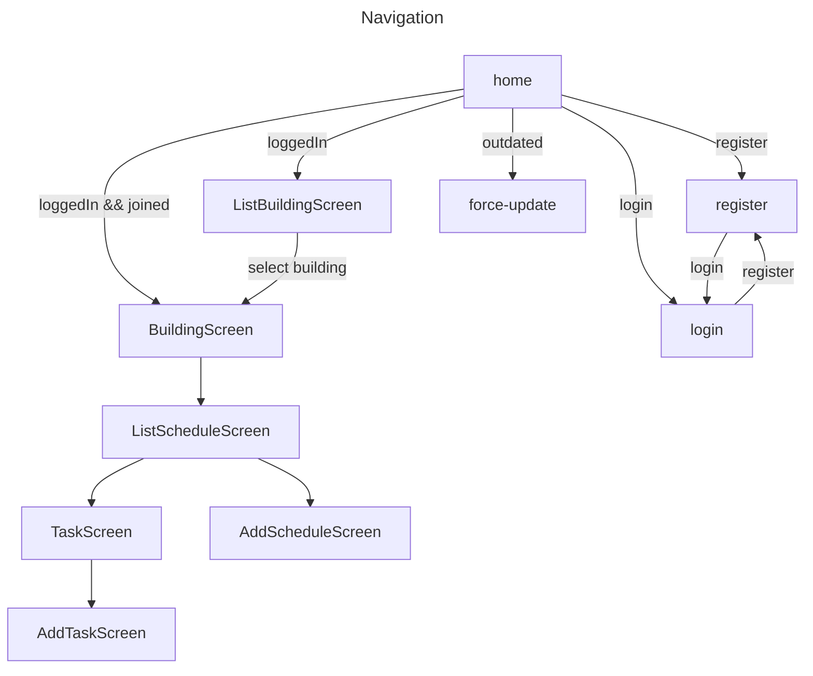

```mermaid
---
title: Navigation
---

flowchart TD


%% locations
locations[ListBuildingScreen]
building/buildingID[BuildingScreen]

%% schedule
rooms/roomID/schedules[ListScheduleScreen]
schedules/scheduleID/tasks[TaskScreen]
schedules/roomID/add[AddScheduleScreen]
tasks/scheduleID/add[AddTaskScreen]

home -- register --> register
home -- login --> login
home -- loggedIn && joined--> building/buildingID
home -- loggedIn --> locations
home -- outdated --> force-update
login -- register --> register
register -- login --> login

%% location
locations -- select building --> building/buildingID
building/buildingID --> rooms/roomID/schedules
%% schedule
rooms/roomID/schedules --> schedules/roomID/add

rooms/roomID/schedules --> schedules/scheduleID/tasks
schedules/scheduleID/tasks --> tasks/scheduleID/add
schedules/roomID/add
tasks/scheduleID/add
```
